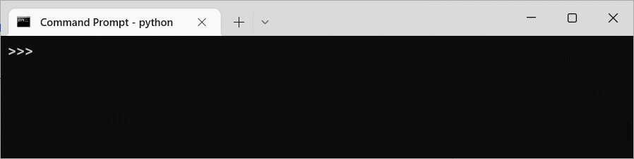

# semanticscholar

[](https://pypi.org/project/semanticscholar)

[](https://github.com/danielnsilva/semanticscholar/blob/master/LICENSE)
[](https://www.codacy.com/gh/danielnsilva/semanticscholar/dashboard?utm_source=github.com&amp;utm_medium=referral&amp;utm_content=danielnsilva/semanticscholar&amp;utm_campaign=Badge_Grade)
[](https://www.codacy.com/gh/danielnsilva/semanticscholar/dashboard?utm_source=github.com&utm_medium=referral&utm_content=danielnsilva/semanticscholar&utm_campaign=Badge_Coverage)

Unofficial Python client library for [Semantic Scholar APIs](https://api.semanticscholar.org/), currently supporting the Academic Graph API and Recommendations API.



## Table of Contents

<!-- START doctoc generated TOC please keep comment here to allow auto update -->
<!-- DON'T EDIT THIS SECTION, INSTEAD RE-RUN doctoc TO UPDATE -->

- [How to install](#how-to-install)
- [Usage](#usage)
  - [Paper Lookup](#paper-lookup)
  - [Author Lookup](#author-lookup)
  - [Retrieve multiple items at once](#retrieve-multiple-items-at-once)
  - [Search for papers and authors](#search-for-papers-and-authors)
  - [Traversing search results](#traversing-search-results)
  - [Recommended papers](#recommended-papers)
  - [Query parameters for all methods](#query-parameters-for-all-methods)
  - [Query parameters for all search methods](#query-parameters-for-all-search-methods)
  - [Query parameters for search papers](#query-parameters-for-search-papers)
  - [Other options](#other-options)
  - [Accessing the Data Partner's API](#accessing-the-data-partners-api)
- [Semantic Scholar API official docs and additional resources](#semantic-scholar-api-official-docs-and-additional-resources)

<!-- END doctoc generated TOC please keep comment here to allow auto update -->

## How to install

```console
pip install semanticscholar
```

## Usage

Programmatically retrieve paper and author data by ID or query string.
Can be used to access both the public API and the S2 Data Partner's API using a private key.

### Paper Lookup

To access paper data:

```python
from semanticscholar import SemanticScholar
sch = SemanticScholar()
paper = sch.get_paper('10.1093/mind/lix.236.433')
paper.title
```

Output:

```console
'Computing Machinery and Intelligence'
```

### Author Lookup

To access author data:

```python
from semanticscholar import SemanticScholar
sch = SemanticScholar()
author = sch.get_author(2262347)
author.name
```

Output:

```console
'Alan M. Turing'
```

### Retrieve multiple items at once

You can fetch up to 1000 distinct papers or authors in one API call. To do that, provide a list of IDs (array of strings).

Get details for multiple papers:

```python
from semanticscholar import SemanticScholar
sch = SemanticScholar()
list_of_paper_ids = [
     'CorpusId:470667',
     '10.2139/ssrn.2250500',
     '0f40b1f08821e22e859c6050916cec3667778613'
]
results = sch.get_papers(list_of_paper_ids)
for item in results:
     print(item.title)
```

Output:

```console
Improving Third-Party Audits and Regulatory Compliance in India
How Much Should We Trust Differences-in-Differences Estimates?
The Miracle of Microfinance? Evidence from a Randomized Evaluation
```

Get details for multiple authors:

```python
from semanticscholar import SemanticScholar
sch = SemanticScholar()
list_of_author_ids = ['3234559', '1726629', '1711844']
results = sch.get_authors(list_of_author_ids)
for item in results:
     print(item.name)
```

Output:

```console
E. Dijkstra
D. Parnas
I. Sommerville
```

### Search for papers and authors

To search for papers by keyword:

```python
from semanticscholar import SemanticScholar
sch = SemanticScholar()
results = sch.search_paper('Computing Machinery and Intelligence')
print(f'{results.total} results.', f'First occurrence: {results[0].title}.')
```

Output:

```console
492 results. First occurrence: Computing Machinery and Intelligence.
```

> **Warning**
>
> From the [official documentation](https://api.semanticscholar.org/api-docs/graph#tag/Paper-Data/operation/get_graph_get_paper_search): "Because of the subtleties of finding partial phrase matches in different parts of the document, be cautious about interpreting the total field as a count of documents containing any particular word in the query."

To search for authors by name:

```python
from semanticscholar import SemanticScholar
sch = SemanticScholar()
results = sch.search_author('Alan M. Turing')
print(f'{results.total} results.', f'First occurrence: {results[0].name}.')
```

Output:

```console
4 results. First occurrence: A. Turing.
```

### Traversing search results

Each call to ```search_paper()``` and ```search_author()``` will paginate through results, returning the list of papers or authors up to the bound limit (default value is 100). You can retrieve the next batch of results by calling ```next_page()``` or simply iterating over all of them:

```python
from semanticscholar import SemanticScholar
sch = SemanticScholar()
results = sch.search_paper('Computing Machinery and Intelligence')
for item in results:
     print(item.title)
```

Output:

```console
Computing Machinery and Intelligence
Computing Machinery and Intelligence (1950)
Artificial intelligence in the research of consciousness and in social life (in honor of 70-years anniversary of A. Turing’s paper “Computing Machinery and Intelligence” (papers of the “round table”)
Studies on computing machinery and intelligence
On Computing Machinery and Intelligence
...
Information revolution: Impact of technology on global workforce
```

When iterating over the return of search methods, the client library will always traverse all results regardless of the number of pages. If just the first batch is enough, you can avoid more calls to API, handling only current results:

```python
from semanticscholar import SemanticScholar
sch = SemanticScholar()
results = sch.search_paper('Computing Machinery and Intelligence')
for item in results.items:
     print(item.title)
```

Output:

```console
Computing Machinery and Intelligence
Computing Machinery and Intelligence (1950)
Artificial intelligence in the research of consciousness and in social life (in honor of 70-years anniversary of A. Turing’s paper “Computing Machinery and Intelligence” (papers of the “round table”)
Studies on computing machinery and intelligence
On Computing Machinery and Intelligence
...
Building Thinking Machines by Solving Animal Cognition Tasks
```

### Recommended papers

To get recommended papers for a given paper:

```python
from semanticscholar import SemanticScholar
sch = SemanticScholar()
results = sch.get_recommended_papers('10.2139/ssrn.2250500')
for item in results:
     print(item.title)
```

Output:

```console
Microcredit: Impacts and promising innovations
MIT Open Access
The Econmics of Badmouthing: Libel Law and the Underworld of the Financial Press in France before World War I
Give Biden a 6-Point
Getting more value from Australian Intergenerational Reports
...
Structural Change and Economic Dynamics
```

To get recommended papers based on a list of positive and negative paper examples:

```python
from semanticscholar import SemanticScholar
sch = SemanticScholar()
positive_paper_ids = ['10.1145/3544585.3544600']
negative_paper_ids = ['10.1145/301250.301271']
results = sch.get_recommended_papers_from_lists(positive_paper_ids, negative_paper_ids)
for item in results:
     print(item.title)
```

Output:

```console
BUILDING MINIMUM SPANNING TREES BY LIMITED NUMBER OF NODES OVER TRIANGULATED SET OF INITIAL NODES
Recognition of chordal graphs and cographs which are Cover-Incomparability graphs
Minimizing Maximum Unmet Demand by Transportations Between Adjacent Nodes Characterized by Supplies and Demands
Optimal Near-Linear Space Heaviest Induced Ancestors
Diameter-2-critical graphs with at most 13 nodes
...
Advanced Heuristic and Approximation Algorithms (M2)
```

You can also omit the list of negative paper IDs; in which case, the API will return recommended papers based on the list of positive paper IDs only.

### Query parameters for all methods

#### ```fields: list```

The list of the fields to be returned. By default, the response includes all fields. As explained in [official documentation](https://api.semanticscholar.org/api-docs/graph), fields like ```papers``` (author lookup and search) may result in responses bigger than the usual size and affect performance. Consider reducing the list. Check [official documentation](https://api.semanticscholar.org/api-docs/graph) for a list of available fields.

```python
from semanticscholar import SemanticScholar
sch = SemanticScholar()
results = sch.search_paper('software engineering', fields=['title','year'])
for item in results:
     print(item)
```

Output:

```console
{'paperId': 'd0bc1501ae6f54dd16534e651d90d2aeeeb1cfc1', 'title': 'Software engineering: What is it?', 'year': 2018}
{'paperId': 'f70b2f20be241f445a61f33c4b8e76e554760340', 'title': 'Software Engineering for Machine Learning: A Case Study', 'year': 2019}
{'paperId': '55bdaa9d27ed595e2ccf34b3a7847020cc9c946c', 'title': 'Performing systematic literature reviews in software engineering', 'year': 2006}
{'paperId': '27e57cc2f22c1921d2a1c3954d5062e3fe391553', 'title': 'Guidelines for conducting and reporting case study research in software engineering', 'year': 2009}    
{'paperId': '81dbfc1bc890368979399874e47e0529ddceaece', 'title': "Software Engineering: A Practitioner's Approach", 'year': 1982}
...
```

### Query parameters for all search methods

#### ```limit: int```

This parameter represents the maximum number of results to return on each call to API, and its value can't be higher than 100, which is the default value. According to [official documentation](https://api.semanticscholar.org/api-docs/graph), setting a smaller limit reduces output size and latency.

```python
from semanticscholar import SemanticScholar
sch = SemanticScholar()
results = sch.search_paper('software engineering', limit=5)
len(results)
```

Output:

```console
5
```

### Query parameters for search papers

#### ```year: str```

Restrict results to a specific publication year or a given range, following the patterns '{year}' or '{start}-{end}'. Also you can omit the start or the end. Examples: '2000', '1991-2000', '1991-', '-2000'.

```python
from semanticscholar import SemanticScholar
sch = SemanticScholar()
results = sch.search_paper('software engineering', year=2000)
results[0].year
```

Output:

```console
2000
```

#### ```fields_of_study: list```

Restrict results to a given list of fields of study. Check [official documentation](https://api.semanticscholar.org/api-docs/graph#tag/Paper-Data/operation/get_graph_get_paper_search) for a list of available fields.

```python
from semanticscholar import SemanticScholar
sch = SemanticScholar()
results = sch.search_paper('software engineering', fields_of_study=['Computer Science','Education'])
results[0].s2FieldsOfStudy
```

Output:

```console
[{'category': 'Computer Science', 'source': 'external'}, {'category': 'Computer Science', 'source': 's2-fos-model'}]
```

### Other options

#### ```timeout: int```

You can set the wait time for a response. By default, requests to API will wait for 10 seconds until the Timeout Exception raises. To change the default value, specify it at instance creation of ```SemanticScholar``` class:

```python
from semanticscholar import SemanticScholar
sch = SemanticScholar(timeout=5)
```

or set ```timeout``` property value:

```python
from semanticscholar import SemanticScholar
sch = SemanticScholar()
sch.timeout = 5
```

### Accessing the Data Partner's API

If you are a Semantic Scholar Data Partner you can provide the private key as an optional argument:

```python
from semanticscholar import SemanticScholar
s2_api_key = '40-CharacterPrivateKeyProvidedToPartners'
sch = SemanticScholar(api_key=s2_api_key)
```

## Semantic Scholar API official docs and additional resources

If you have concerns or feedback specific to this library, feel free to [open an issue](https://github.com/danielnsilva/semanticscholar/issues). However, the official documentation provides additional resources for broader API-related issues.

- For details on Semantic Scholar APIs capabilities and limits, [go to the official documentation](https://api.semanticscholar.org/api-docs/graph).
- The [Frequently Asked Questions](https://www.semanticscholar.org/faq) page also provides helpful content if you need a better understanding of data fetched from Semantic Scholar services.
- This [official GitHub repository](https://github.com/allenai/s2-folks) allows users to report issues and suggest improvements.
- There is also a community on [Slack](https://join.slack.com/t/semanticschol-xyj3882/shared_invite/zt-1on75e4jr-c0sXVlxEovvtMRQDnTZYAQ).
